# Job Application Agents

AI-powered resume tailoring tool that optimizes your resume for specific job applications while preserving factual accuracy.

## Features

- **Resume Parsing**: Supports PDF, DOCX, and plain text resumes
- **Job Scraping**: Fetches job postings from URLs or accepts pasted text
- **Skills Matching**: Analyzes how your skills match job requirements
- **Smart Tailoring**: Rephrases and reorders content to highlight relevant experience
- **Fact Verification**: Ensures no fabricated content is added
- **Multiple Outputs**: Download as Markdown or PDF

## Quick Start

### Prerequisites

- Python 3.11+
- An Anthropic API key

### Installation

```bash
# Clone the repository
git clone https://github.com/yourusername/job-application-agents.git
cd job-application-agents

# Create virtual environment
python -m venv venv
source venv/bin/activate  # On Windows: venv\Scripts\activate

# Install dependencies
pip install -r requirements.txt

# Set up environment variables
cp .env.example .env
# Edit .env and add your ANTHROPIC_API_KEY
```

### Running the Application

```bash
# Using the run script (recommended - enables PDF export)
./run.sh

# Or directly with streamlit
streamlit run app/main.py
```

Open your browser to `http://localhost:8501`

**Note:** For PDF export, you need system libraries:
```bash
brew install pango cairo gdk-pixbuf libffi
```

## How It Works

The application uses a multi-agent pipeline powered by Claude:

1. **Upload** your resume (PDF, DOCX, or TXT)
2. **Provide** a job posting (URL or paste text)
3. **Analyze** - The AI extracts job requirements and matches your skills
4. **Tailor** - Your resume is optimized with relevant keywords and reordering
5. **Verify** - A fact-checker ensures no fabricated content was added
6. **Download** - Get your tailored resume as Markdown or PDF

## Architecture

```mermaid
flowchart TB
    subgraph Input["📥 Input Layer"]
        Resume["Resume\n(PDF/DOCX/TXT)"]
        JobAd["Job Posting\n(URL/Text)"]
    end

    subgraph Parsers["🔍 Document Parsers"]
        PDF["PDF Parser\n(pdfplumber)"]
        DOCX["DOCX Parser\n(python-docx)"]
        Scraper["Job Scraper\n(httpx + bs4)"]
    end

    subgraph Agents["🤖 AI Agent Pipeline (Claude)"]
        direction TB
        A1["1️⃣ Job Analyzer\nExtract requirements & keywords"]
        A2["2️⃣ Resume Parser\nStructure into sections"]
        A3["3️⃣ Skill Matcher\nCompare & identify gaps"]
        A4["4️⃣ Resume Tailor\nOptimize content"]
        A5["5️⃣ Fact Checker\nVerify accuracy"]

        A1 --> A3
        A2 --> A3
        A3 --> A4
        A4 --> A5
    end

    subgraph Output["📤 Output Layer"]
        MD["Markdown\nResume"]
        PDFOut["PDF\nResume"]
        Report["Change\nReport"]
    end

    Resume --> PDF & DOCX
    JobAd --> Scraper
    PDF & DOCX --> A2
    Scraper --> A1
    A5 --> MD & PDFOut & Report

    subgraph UI["🖥️ Streamlit Web UI"]
        Upload["Step 1: Upload"]
        Process["Step 2: Process"]
        Results["Step 3: Results"]
        Upload --> Process --> Results
    end

    style Agents fill:#e1f5fe
    style Input fill:#fff3e0
    style Output fill:#e8f5e9
    style UI fill:#fce4ec
```



### Agent Pipeline Details

| Agent | Input | Output | Purpose |
|-------|-------|--------|---------|
| **Job Analyzer** | Raw job posting | Structured requirements | Extract skills, keywords, qualifications |
| **Resume Parser** | Raw resume text | Structured sections | Parse into editable components |
| **Skill Matcher** | Resume + Job data | Match analysis | Identify matches, gaps, transferable skills |
| **Resume Tailor** | Resume + Matches | Optimized resume | Rephrase & reorder (no new facts) |
| **Fact Checker** | Original + Tailored | Verification report | Ensure no hallucinated content |

## Project Structure

```
job-application-agents/
├── app/
│   ├── main.py              # Streamlit UI
│   ├── config/              # Configuration
│   ├── models/              # Data models
│   ├── parsers/             # Document parsing
│   ├── agents/              # LLM agents
│   ├── generators/          # Output generation
│   └── services/            # Orchestration
├── templates/               # HTML/CSS templates
├── tests/                   # Test files
├── requirements.txt         # Dependencies
└── .env.example            # Environment template
```

## Key Principles

- **Factual Accuracy**: The tool only rephrases existing content—it never adds new facts, achievements, or metrics
- **Transparency**: Every change is tracked and reported
- **Verification**: A dedicated fact-checker agent validates all modifications

## Development

```bash
# Run tests
pytest tests/

# Type checking
mypy app/

# Linting
ruff check app/
```

## License

MIT License
